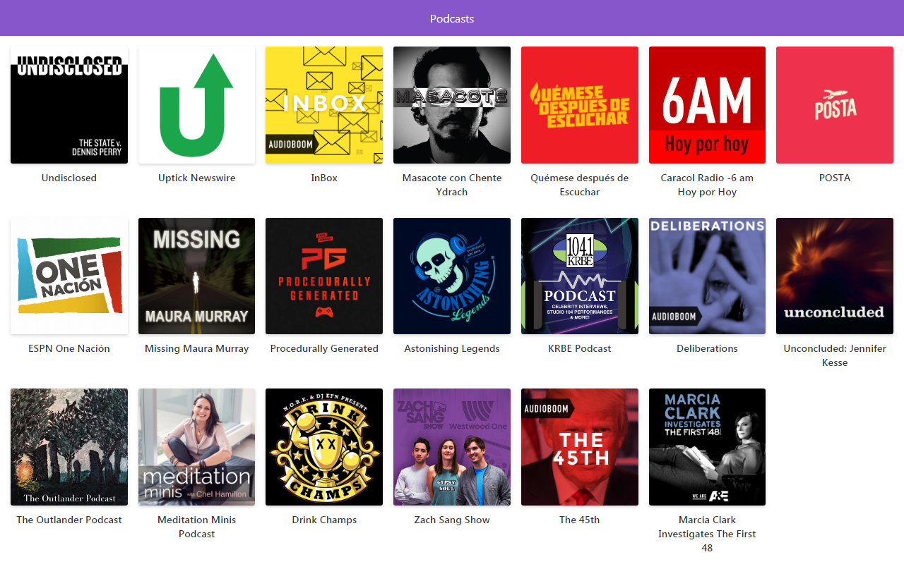

# App de Podcasts del Curso de Next.JS en Platzi

Este repositorio contiene una app sencilla para ver podcasts con la API de Audioboom desarrollada con el Framework Web Next.js.

[Ver la aplicación](https://app-podcasts-huthdkasle.now.sh)

## Cómo funciona?

Requiere Node.JS 10

* `npm install` para instalar las dependencias.
* `npm run dev` para el entorno de desarrollo.
* `npm run build && npm start` para el entorno de producción.

## Licencia 

MIT
